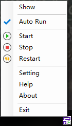

# NotificationTool
NotificationTool is a gadget that lets your program run to the `System Notification`.

It can simply control your program to `start`, `stop`, `restart`, `exit`, `auto run` and `open the specified page`.

Currently supports `Windows`, need to install`. Net Framework 4.0` or later.

##  Simple example



Configuration file `notification.tool.config.json` contents:

```json
[
  {
    "text": "Show",
    "cmd": "start http://localhost:8888"
  },
  {
    "cmdkey": "-"
  },
  {
    "text": "Auto Run",
    "cmd": "main", // Key for automatic startup requires the operating system to be unique.
    "cmdkey": "AutoRun"
  },
  {
    "cmdkey": "-"
  },
  {
    "text": "Start",
    "cmd": "main.exe",
    "cmdkey": "Start"
  },
  {
    "text": "Stop",
    "cmdkey": "Stop"
  },
  {
    "text": "Restart",
    "cmdkey": "Restart"
  },
  {
    "cmdkey": "-"
  },
  {
    "text": "Setting",
    "cmd": "start http://localhost:8888/setting"
  },
  {
    "text": "Help",
    "cmd": "start http://localhost:8888/help"
  },
  {
    "text": "About",
    "cmd": "start http://localhost:8888/about"
  },
  {
    "cmdkey": "-"
  },
  {
    "text": "Exit|Are you sure you want to exit this program?",
    "cmdkey": "Exit"
  }
]
```


## Configuration File

### Menu

| Field  | Description                              | Other                                    |
| ------ | ---------------------------------------- | ---------------------------------------- |
| text   | Menu name                                | cmdkey：Exit，Before `|` is the menu name, After `|`  is click on the prompt to exit the window. |
| cmd    | Execute the command                      | cmdkey：Start，Execute the command。E.g："main",  "python manage.py runserver" etc.    <br />cmdkey：AutoRun，The system automatically starts the logo, the system is unique.  <br />cmdkey is null or empty：Execute the command, commonly used for "start http: // localhost: 8888", said the browser to open this page. |
| image  | The icon on the menu                     | cmdkey：AutoRun，`invalid`.    <br />cmdkey：Start, Stop, Restart，have the default icon, set the image to override the default. |
| icon   | The icon of the Notification area after execution | cmdkey：Start, Stop, Restart effective，have the default icon, set the icon to override the default. |
| cmdkey | Functional menu                          | See details below                        |


### cmdkey

| cmdkey  | 说明                                  |
| ------- | ----------------------------------- |
| Exit    | Execute the exit command            |
| AutoRun | Set to start with the system        |
| Start   | Start command                       |
| Stop    | Execute the stop command            |
| Restart | Execute the stop and start commands |
| -       | Separator                           |

## Other File

`notification.tool.error.log` is error log.

`notification.tool.output.log` is output log.

`notification.tool.ico` is default icon.

 The files in `NotificationTool` directory are for the files that make it easy for you to create your icons.


NotificationTool 是让你的程序运行到系统Notification 的小工具。

它可以简单的控制你程序的 `启动`，`停止`，`重启`，`退出`，`自动启动` 和 `打开指定页面` 。

目前支持Windows，需安装.Net Framework 4.0以上版本。


# 中文说明

## 简单的例子


配置文件`notification.tool.config.json` 的内容：

```json
[
  {
    "text": "Show",
    "cmd": "start http://localhost:8888"
  },
  {
    "cmdkey": "-"
  },
  {
    "text": "Auto Run",
    "cmd": "main", // Key for automatic startup requires the operating system to be unique.
    "cmdkey": "AutoRun"
  },
  {
    "cmdkey": "-"
  },
  {
    "text": "Start",
    "cmd": "main.exe",
    "cmdkey": "Start"
  },
  {
    "text": "Stop",
    "cmdkey": "Stop"
  },
  {
    "text": "Restart",
    "cmdkey": "Restart"
  },
  {
    "cmdkey": "-"
  },
  {
    "text": "Setting",
    "cmd": "start http://localhost:8888/setting"
  },
  {
    "text": "Help",
    "cmd": "start http://localhost:8888/help"
  },
  {
    "text": "About",
    "cmd": "start http://localhost:8888/about"
  },
  {
    "cmdkey": "-"
  },
  {
    "text": "Exit|Are you sure you want to exit this program?",
    "cmdkey": "Exit"
  }
]
```

### Menu

| 属性     | 说明                  | 特殊说明                                     |
| ------ | ------------------- | ---------------------------------------- |
| text   | 菜单名称                | cmdkey：Exit时，`|`前为菜单名称，之后为点击后的提示退出窗口内容。  |
| cmd    | 执行的命令               | cmdkey：Start时，后接执行命令。例如："main",  "python manage.py runserver" 等    <br />cmdkey：AutoRun时，为系统自动启动标识，系统唯一。  <br />cmdkey为空时：执行一次的命令，常用的为"start http://localhost:8888"，表示用浏览器打开这个页面。 |
| image  | 菜单上的图标              | cmdkey：AutoRun时，无效。    <br />cmdkey：Start, Stop, Restart时，有默认图标，设置image将覆盖默认。 |
| icon   | 执行后Notification区的图标 | cmdkey：Start, Stop, Restart时有效，有默认图标，设置icon将覆盖默认。 |
| cmdkey | 功能性菜单               | 详情见下表                                    |


### cmdkey说明

| cmdkey  | 说明        |
| ------- | --------- |
| Exit    | 执行退出命令    |
| AutoRun | 设置让随系统启动  |
| Start   | 启动命令      |
| Stop    | 执行停止命令    |
| Restart | 执行停止和启动命令 |
| -       | 分割线       |

### 其他文件

`notification.tool.error.log` 是错误日志。

`notification.tool.output.log` 是输出日志。

`notification.tool.ico` 是默认图标。

 `NotificationTool` 目录内的文件为方便您制作你图标的文件。